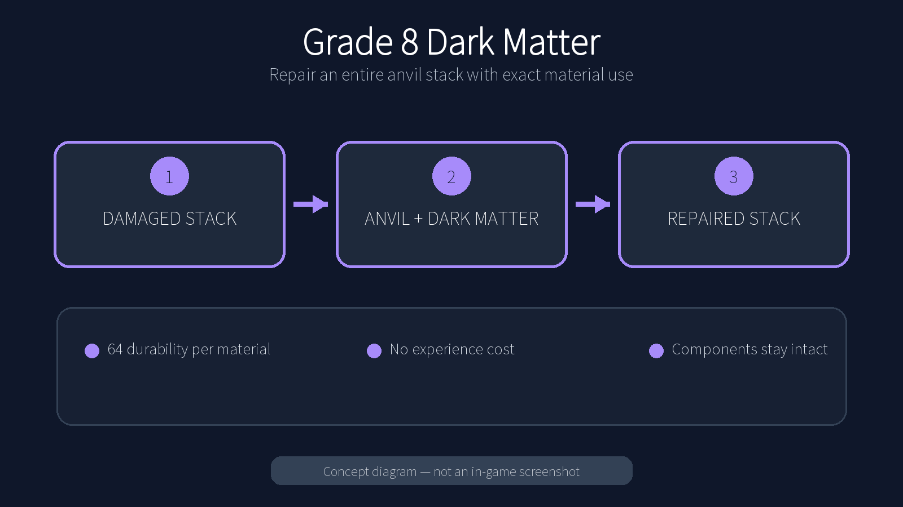

# Grade 8 Dark Matter

<!-- PROJECT_PAGE_START -->
Repair a whole stack of damaged equipment in one anvil operation, with exact material use and no experience cost.



## What it changes

- Repairs **64 durability per material item** across the stack.
- Consumes only the amount needed; any unused material stays in its slot.
- Keeps enchantments, names, attributes, components and other item data intact.
- Refuses recipes that would make no progress or consume an unsafe input.

## Compatibility

Available for the supported Fabric, Forge and NeoForge versions listed on the platform Versions page. Fabric builds require Fabric API.

## Use

Put a damaged stack in the left anvil slot and Grade 8 Dark Matter in the material slot. The output shows the repaired stack and the anvil charges no XP.

## Download and support

Use the platform Versions page for exact game-version and loader files. Report reproducible problems through the project GitHub Issues page.
<!-- PROJECT_PAGE_END -->

---

## Additional technical details

## Supported matrix

Exactly these source generations are included:

| Minecraft | Fabric | NeoForge | Java |
|---|---:|---:|---:|
| 1.21.1 | yes | yes | 21 |
| 26.1.2 | yes | yes | 25 |
| 26.2 | yes | yes | 25 |

Each directory under [`versions/`](versions/) is an independent Gradle build with API-specific source. No runtime version conditions are used. Create and Botania are optional data-pack integrations, not compile-time or metadata dependencies.

## Build and test

Use the guarded Gradle runner from a generation directory:

```sh
cd versions/1.21.1
/home/rin/.local/bin/rin-gradle ./gradlew clean test build
```

Or validate the complete matrix:

```sh
./scripts/check-matrix.sh
```

The `policy` project contains pure repair-policy tests and static source/metadata contracts. These checks do not launch Minecraft.

## License

MIT. The in-game item texture and bundled loader icon are original deterministic pixel art generated by [`tools/generate_versions.py`](tools/generate_versions.py). The marketplace artwork and its reproducible prompt are preserved under [`docs/icon-source/`](docs/icon-source/).
